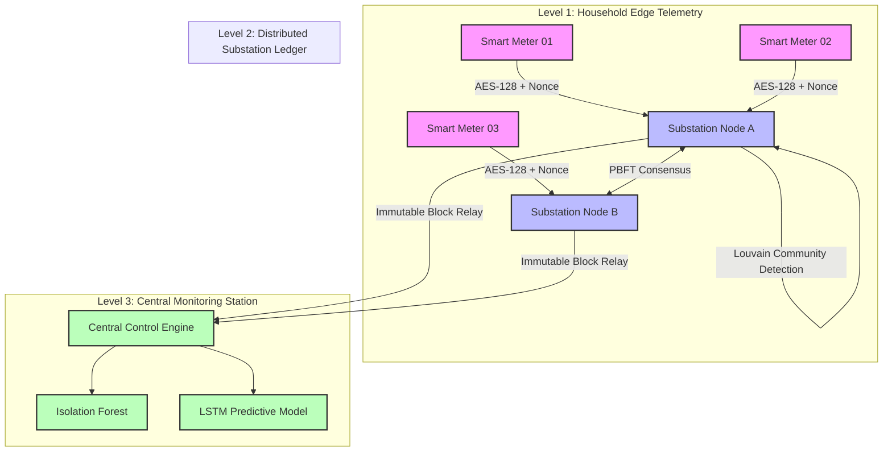
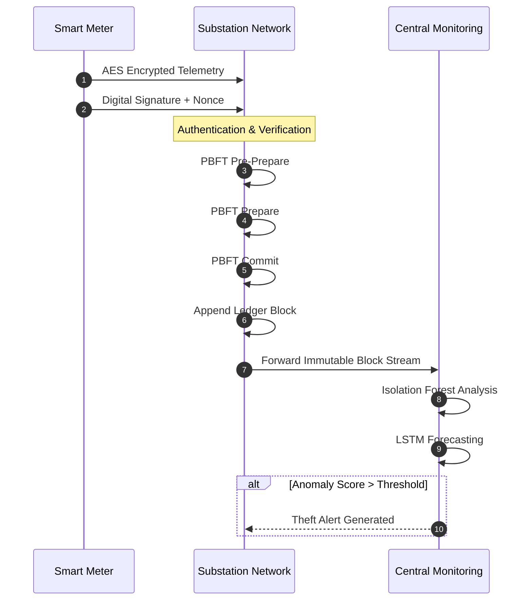

# A Novel Blockchain-Based Energy Anti-Theft System

### Advanced with Graph Theory & Machine Learning for Real-Time Anomaly Detection


> A decentralized, tamper-proof, and intelligent smart-grid security framework designed to combat electricity theft through Blockchain, Graph Theory, and Machine Learning.

---

## 📖 Table of Contents

* [Problem Statement](#-problem-statement)
* [Key Innovations](#-key-innovations)
* [System Architecture](#-system-architecture)
* [Cryptographic & Analytical Data Flow](#-cryptographic--analytical-data-flow)
* [Repository Structure](#-repository-structure)
* [Mathematical Foundations](#-mathematical-foundations)
* [Recognition & Validation](#-recognition--validation)
* [Project Roadmap](#-project-roadmap)
* [Future Scope](#-future-scope)

---

## ⚡ Problem Statement

Electricity theft remains one of the largest contributors to power distribution losses worldwide.

Common forms of theft include:

* Direct Line Tapping
* Meter Tampering
* Consumption Record Manipulation
* Fraudulent Reporting
* Corruption at Distribution Levels

Conventional monitoring systems are largely centralized and vulnerable to manipulation, delayed detection, and lack of transparency.

This project proposes a decentralized architecture capable of securing energy distribution while enabling real-time anomaly detection and predictive maintenance.

---

## 💡 Key Innovations

### 🔐 Blockchain Secured Smart Grid

* Distributed ledger architecture
* Tamper-resistant energy records
* Decentralized verification
* Transparent auditing

### 🤖 AI-Powered Theft Detection

* Isolation Forest anomaly detection
* Self-adaptive monitoring
* Real-time fraud detection

### 📊 Graph Theory Optimization

* Louvain Community Detection
* Z-Score based anomaly localization
* Localized theft identification

### 🛡 Multi-Layer Security

* AES encrypted communication
* Unique Meter IDs
* Digital signatures
* Nonce & timestamp verification
* Hardware tamper detection

### 🌍 Rural & Urban Deployment Support

* LoRaWAN
* RF Communication
* WiFi Integration

---

## 🏗️ System Architecture

The framework operates across three hierarchical layers to ensure scalability, security, and computational efficiency.



---

## 🔄 Cryptographic & Analytical Data Flow



---

## 📂 Repository Structure

```text
.
├── hardware_telemetry
│   ├── meter_ingest.ino
│   ├── aes_encrypt.h
│   └── anti_tamper.c
│
├── substation_blockchain
│   ├── pbft_mock.py
│   ├── ledger_manager.py
│   └── louvain_cluster.py
│
├── central_ml_models
│   ├── isolation_forest.py
│   ├── kmeans_cluster.py
│   └── lstm_predictive.py
│
├── data_simulations
│   ├── grid_data_generator.py
│   └── run_mock_pipeline.py
│
├── research_paper
│   └── RESEARCH_PAPER_FINAL.pdf
│
├── requirements.txt
└── README.md
```

---

## 🧮 Mathematical Foundations

### Louvain Modularity Optimization

The graph representing household energy consumption is defined as:

$$
G = (V,E)
$$

where:

* V = Households
* E = Similarity Edges

The modularity score is:

$$
Q=
\frac{1}{2m}
\sum_{ij}
\left(
A_{ij}
------

\frac{k_i k_j}{2m}
\right)
\delta(c_i,c_j)
$$

Maximizing Q enables the discovery of communities with similar consumption behavior.

---

### Z-Score Analysis

For each household:

$$
Z=
\frac{P_i-\mu}{\sigma}
$$

Where:

* Pi = Individual Consumption
* μ = Mean Consumption
* σ = Standard Deviation

Abnormal Z-Scores indicate potential theft.

---

### Isolation Forest Anomaly Score

$$
s(x,n)=2^{-\frac{E(h(x))}{c(n)}}
$$

Where:

* E(h(x)) = Average Path Length
* c(n) = Normalization Constant

Anomaly scores approaching 1 indicate suspicious activity.

---

## 🏆 Recognition & Validation

### Research Status

✅ Research Paper Completed

✅ Architecture Designed

✅ Mathematical Framework Validated

✅ Simulation Environment Developed

✅ Synthetic Dataset Testing Completed

✅ MVP Validation Achieved

### Core Technologies Evaluated

* Blockchain Ledger Design
* PBFT Consensus
* Louvain Algorithm
* Isolation Forest
* K-Means Clustering
* LSTM Neural Networks
* AES Encryption

---

## 📈 MVP Results

Simulation studies indicate:

* Accurate anomaly detection across synthetic theft scenarios
* Distributed tamper-resistant record management
* Improved visibility into localized consumption anomalies
* Scalable deployment model for both rural and urban regions

---

## 🗺️ Project Roadmap

### ✅ Phase 1 — Research & Architecture

* Problem Analysis
* Mathematical Modeling
* Security Design

### ✅ Phase 2 — Simulation & MVP Validation

* Dataset Generation
* Isolation Forest Integration
* Graph Analytics Testing

### 🔄 Phase 3 — Hardware Integration (Current)

* STM8 Firmware Development
* Sensor Integration
* RF/LoRaWAN Communication

### ⏳ Phase 4 — Distributed Deployment

* Multi-Node PBFT Network
* Real-Time Monitoring Dashboard
* Field Testing

---

## 🚀 Future Scope

* Smart City Scale Deployment
* Federated Learning Integration
* Edge AI Inference
* Smart Contract Automation
* Utility Company Integration
* National Grid Security Applications

---

## 📜 License

This repository is intended for research, innovation, academic evaluation, and smart-grid security development.

---

### Author

**Sameer**

Research Focus:

* Blockchain Systems
* Smart Grid Security
* Machine Learning
* Graph Theory
* Embedded Systems
