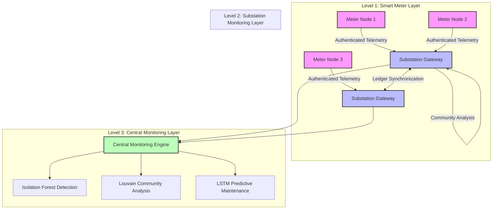

# CryptEthEra

### Blockchain-Assisted Smart Grid Security & Energy Theft Detection Framework

🏆 **Samsung Solve for Tomorrow India 2025 — Grand Finale (Top 20 Teams Nationwide)**

🏆 **Selected for IRIS (Initiative for Research and Innovation in STEM)**

📄 **Independent Research Project integrating Cybersecurity, Blockchain, Graph Theory, Machine Learning, and IoT Systems for Smart Grid Protection**

---

## Overview

CryptEthEra is a cybersecurity-oriented smart grid monitoring framework designed to detect electricity theft, meter tampering, fraudulent reporting, and infrastructure anomalies in power distribution networks.

The framework combines:

* Blockchain-based immutable logging
* Machine Learning anomaly detection
* Graph-theoretic network analysis
* IoT-based telemetry collection
* Cryptographic authentication mechanisms

to create a transparent, tamper-resistant, and scalable monitoring architecture for modern electrical grids.

---

## Problem Statement

Electricity theft remains one of the largest contributors to power distribution losses worldwide.

Common forms of energy theft include:

* Direct line tapping
* Meter tampering
* Consumption record manipulation
* Fraudulent reporting
* Insider corruption within distribution systems

Traditional monitoring architectures are largely centralized and vulnerable to delayed detection, manipulation, and poor traceability.

CryptEthEra proposes a decentralized monitoring framework capable of providing secure data integrity, transparent auditing, and real-time anomaly detection.

---

## Recognition & Validation

### National Recognition

🏆 Samsung Solve for Tomorrow India 2025 — Grand Finale (Top 20)

🏆 Selected for IRIS National Fair

### Research & Prototype Validation

✅ Research Paper Completed

✅ System Architecture Designed

✅ Mathematical Framework Developed

✅ Simulation Environment Implemented

✅ Synthetic Dataset Validation Completed

✅ Hardware MVP Demonstrated

✅ Dashboard-Based Monitoring Demonstrated

🔄 Real-World Field Validation Ongoing

---

## System Architecture

The framework operates across three hierarchical layers to ensure scalability, security, and computational efficiency.



---

## Cybersecurity Threat Model

The system is designed to address multiple attack vectors commonly observed in smart-grid environments.


---

## Hardware Prototype

### Meter Node

* Arduino UNO
* ESP8266 Communication Module
* ZMCT103C Current Transformer
* LCD Interface

Functions:

* Current measurement
* Telemetry generation
* Tamper-event reporting
* Secure communication

### Substation Node

* Arduino Mega
* ESP32 Gateway
* Current Monitoring Sensors
* Residual Current Analysis

Functions:

* Aggregate consumption monitoring
* Theft detection
* Ledger generation
* Central reporting

---

## Cryptographic Security Features

### Device Authentication

Each device is associated with:

* Unique Device ID
* Timestamp Validation
* Nonce Verification
* Digital Signatures

Mitigating:

* Replay attacks
* Device spoofing
* Unauthorized network participation

### Immutable Audit Logging

Consumption events are stored as cryptographically linked records to provide:

* Data integrity
* Tamper evidence
* Transparent auditing

---

## Machine Learning Pipeline

### Isolation Forest

Used for unsupervised anomaly detection.

Applications:

* Electricity theft detection
* Suspicious consumption patterns
* Fraud identification

### LSTM Predictive Maintenance

Research prototype for forecasting:

* Abnormal current behavior
* Infrastructure degradation
* Preventive maintenance requirements

---

## Graph-Theoretic Analysis

### Louvain Community Detection

Consumers are represented as graph nodes.

Edges represent similarity between consumption profiles.

Applications:

* Community discovery
* Local anomaly detection
* Theft hotspot identification

### Z-Score Analysis

Used to identify households with statistically abnormal consumption behavior within a local community.

---

## Mathematical Foundations

### Graph Representation

[
G=(V,E)
]

Where:

* (V) = Households
* (E) = Consumption Similarity Edges

### Modularity Optimization

[
Q=\frac{1}{2m}
\sum_{ij}
\left(
A_{ij}-\frac{k_i k_j}{2m}
\right)
\delta(c_i,c_j)
]

### Z-Score

[
Z=\frac{P_i-\mu}{\sigma}
]

### Isolation Forest Score

[
s(x,n)=2^{-\frac{E(h(x))}{c(n)}}
]

---

## Repository Structure

```text
.
├── hardware/
│   ├── meter_node/
│   └── substation_node/
│
├── software/
│   ├── dashboard/
│   ├── anomaly_detection/
│   ├── graph_analysis/
│   └── ledger/
│
├── datasets/
│   └── synthetic_grid_data/
│
├── research/
│   └── research_paper.pdf
│
├── docs/
│   ├── architecture.md
│   ├── threat_model.md
│   └── deployment_notes.md
│
└── README.md
```

---

## Future Scope

* Federated Learning for distributed anomaly detection
* Edge AI inference on embedded devices
* Secure firmware update mechanisms
* Smart-contract based auditing
* Digital Twin integration
* Utility-scale deployment studies

---

## About the Author

**Sameer**

Research Interests:

* Cybersecurity
* Smart Grid Security
* Machine Learning
* Graph Theory
* Blockchain Systems
* Embedded & IoT Security

### Achievements

🏆 Samsung Solve for Tomorrow India 2025 Grand Finale (Top 20)

🏆 IRIS National Fair Selection

---

## License

This repository is intended for academic research, innovation, cybersecurity education, and smart-grid security development.
