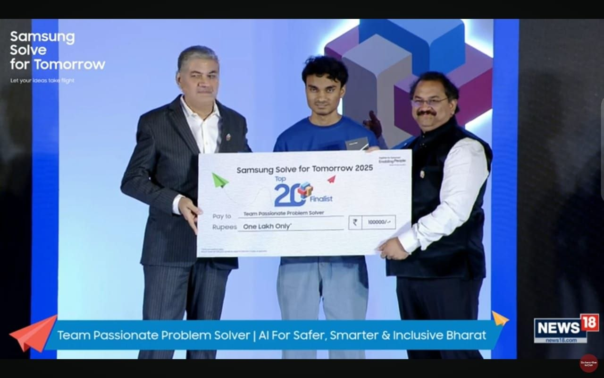
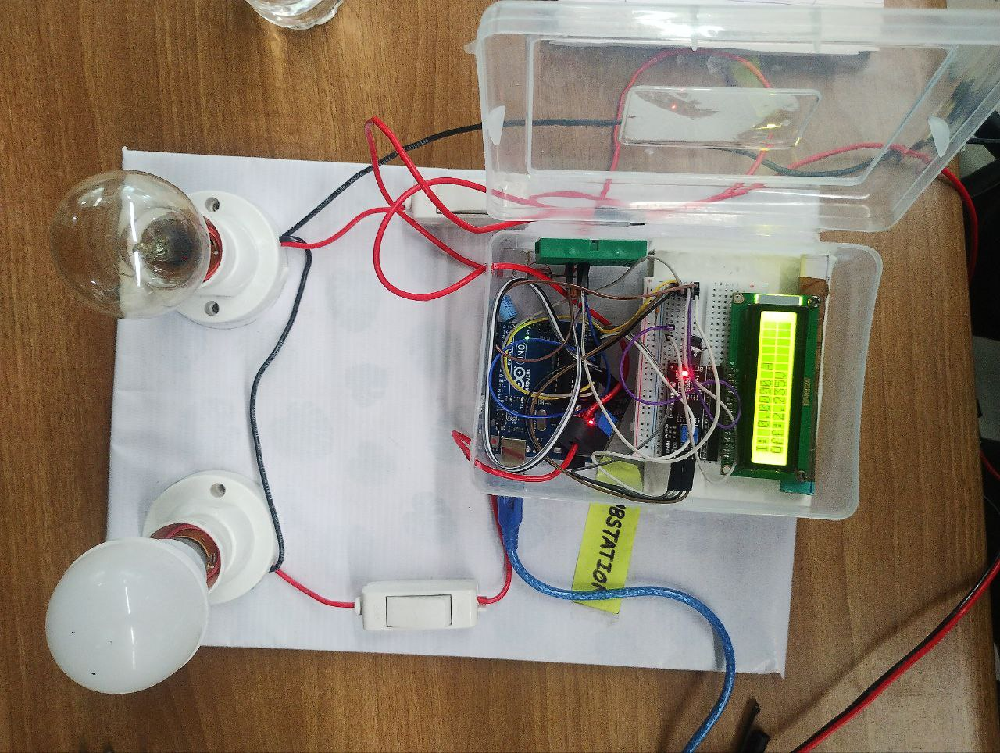
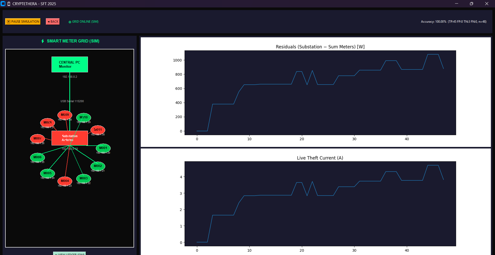
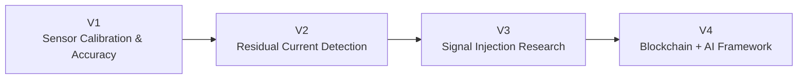
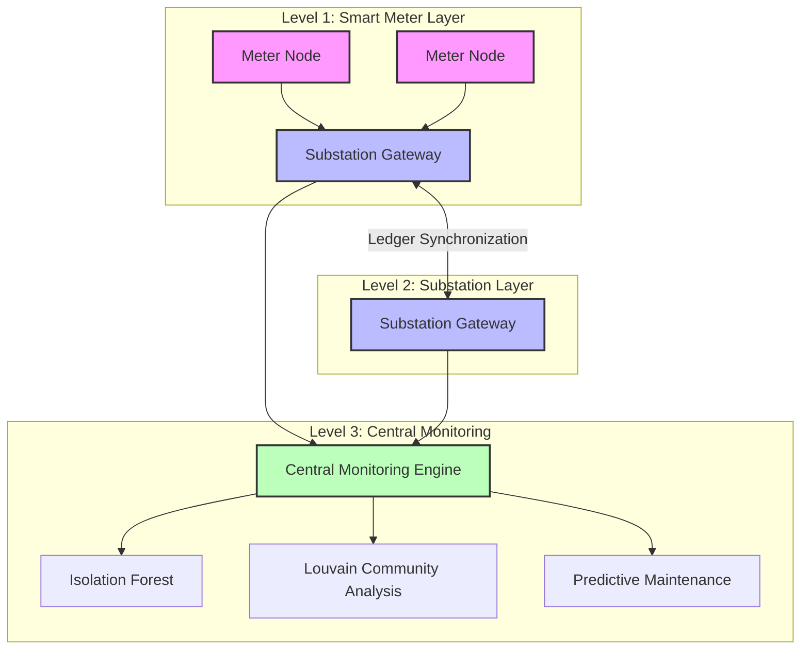
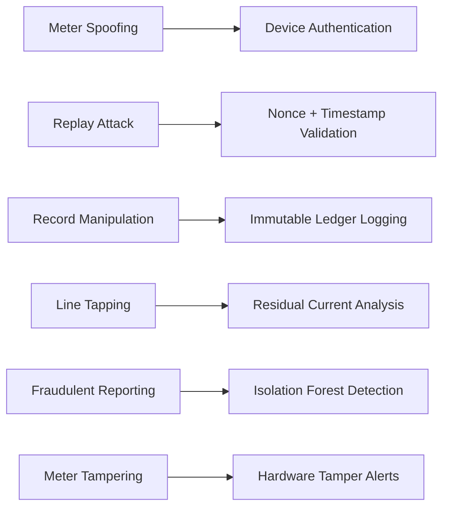

# CryptEthEra
## NOTE : ALL THE FILES COMMITED EARLIER THAN 1 YEAR ARE OUTDATED PREMATURE SKETCHES

### Blockchain-Assisted Smart Grid Security & Energy Theft Detection Framework

🏆 **Samsung Solve for Tomorrow India 2025 — Grand Finale (Top 20 Teams Nationwide)**

🏆 **Selected for IRIS (Initiative for Research and Innovation in STEM)**

📄 **Independent Research Project integrating Cybersecurity, Blockchain, Graph Theory, Machine Learning and IoT Systems for Smart Grid Protection**

---

## HIGHLIGHTS
### Samsung Solve for Tomorrow Grand Finale 


### MVP ( DEMONSTRATED PROTYPE )


### CENTRAL MONITORING DASHBOARD


## Quick Links

* 📄 Research Paper
* 📹 Prototype Demonstration Video
* 🏆 Samsung Solve for Tomorrow Documentation
* 🏆 IRIS Documentation
* 📊 System Architecture
* 🔬 Experimental Research Notes

---

## Overview

CryptEthEra is a cybersecurity-oriented smart-grid monitoring framework designed to detect electricity theft, meter tampering, fraudulent reporting, and infrastructure anomalies in electrical distribution networks.

The framework combines:

* Blockchain-based immutable logging
* Graph-theoretic anomaly detection
* Machine Learning analytics
* IoT telemetry collection
* Cryptographic authentication
* Experimental physical-layer monitoring

to create a transparent, tamper-resistant, and scalable monitoring architecture.

---

## Recognition & Validation

### National Recognition

🏆 Samsung Solve for Tomorrow India 2025 — Grand Finale (Top 20)

🏆 Selected for IRIS National Fair

### Documentation & Media
[SAMSUNG_LIST](https://images.samsung.com/is/content/samsung/assets/in/solvefortomorrow/2025/SFT_20_teams.pdf)

```text
recognition/
├── samsung_sft/
│   ├── grand_finale_selection.pdf
│   ├── pitch_deck.pdf
│   ├── prototype_demo.mp4
│   └── event_photos/
│
├── iris/
│   ├── selection_document.pdf
│   └── participation_material/
```

### Research & Prototype Validation

✅ Research Paper Completed

✅ Mathematical Framework Developed

✅ Hardware MVP Demonstrated

✅ Dashboard Demonstrated

✅ Synthetic Dataset Validation

✅ Cybersecurity Threat Modeling

🔄 Ongoing Experimental Development

---

## Research Evolution

The project evolved through multiple engineering iterations.

| Version | Focus                         | Objective                                                                      |
| ------- | ----------------------------- | ------------------------------------------------------------------------------ |
| V1      | Sensor Calibration & Accuracy | Improve CT sensor stability, RMS measurement and calibration                   |
| V2      | Residual Current Detection    | Detect energy imbalance between feeders and consumers                          |
| V3      | Signal Injection Research     | Explore physical-layer theft detection through frequency and response analysis |
| V4      | Blockchain + AI Framework     | Secure and scale anomaly detection across the grid                             |



---

## Experimental Research

Beyond conventional consumption monitoring, ongoing research investigates active electrical signature injection for theft localization.

### Signal Injection Research

Research objective:

* Inject controlled electrical signatures into power lines
* Observe frequency and impedance response
* Detect unauthorized loads and illegal tapping
* Improve localization of theft events

Potential techniques investigated:

* Frequency response analysis
* Harmonic monitoring
* Impedance variation detection
* Active signal injection
* Time-domain response analysis

### Experimental Documentation

```text
research_experiments/
├── current_sensor_v1/
├── current_sensor_v2/
├── residual_current_detection/
├── signal_injection_v1/
├── signal_injection_v2/
├── frequency_response_tests/
└── experimental_notes/
```

Detailed schematics, circuit revisions, code references and experimental notes are available in the project archive.

---

## System Architecture



---

## Cybersecurity Threat Model



---

## Hardware Prototype

### Meter Node

* Arduino UNO
* ESP8266
* ZMCT103C Current Sensor
* LCD Interface

### Substation Node

* Arduino Mega
* ESP32 Gateway
* Current Monitoring Sensors

### Monitoring System

* Python Dashboard
* Anomaly Detection Engine
* Ledger Visualization
* Event Logging

---

## Machine Learning & Analytics

### Isolation Forest

Applications:

* Theft Detection
* Fraud Identification
* Consumption Anomaly Detection

### Louvain Community Detection

Applications:

* Localized anomaly identification
* Consumption clustering
* Theft hotspot detection

### Predictive Maintenance

Research prototype for:

* Equipment degradation prediction
* Abnormal current behavior analysis
* Preventive maintenance planning

---

## Repository Structure

```text
.
├── hardware/
├── software/
├── datasets/
├── dashboard/
├── research/
├── research_experiments/
├── docs/
├── recognition/
└── README.md
```

---

## Future Scope

* Federated Learning
* Edge AI Inference
* Secure Firmware Updates
* Smart Contract Automation
* Digital Twin Integration
* Utility-Scale Deployment

---

## About the Author

**Sameer**

Research Interests:

* Cybersecurity
* Smart Grid Security
* Machine Learning
* Graph Theory
* Blockchain Systems
* Embedded Systems
* IoT Security

### Achievements

🏆 Samsung Solve for Tomorrow India 2025 Grand Finale (Top 20)

🏆 IRIS Selection

---

## License

This repository is intended for academic research, innovation, cybersecurity education and smart-grid security development.
